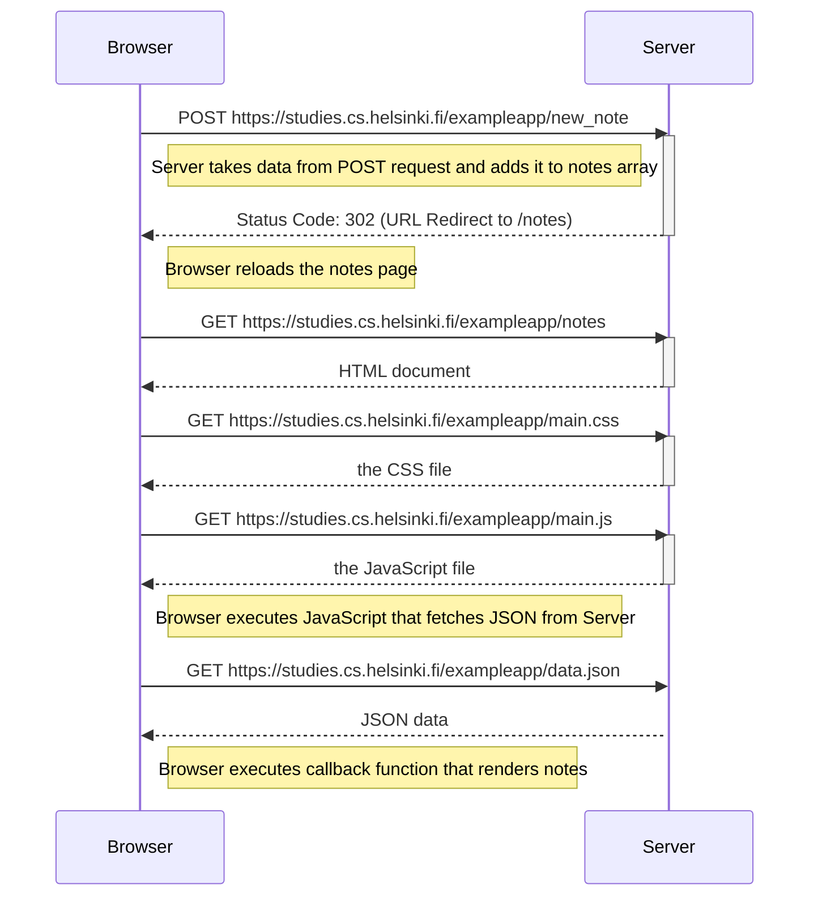

```mermaid

sequenceDiagram
    participant Browser
    participant Server

    Browser->>Server: POST https://studies.cs.helsinki.fi/exampleapp/new_note
    activate Server
    Note left of Server: Server takes data from POST request and adds it to notes array
    Server-->>Browser: Status Code: 302 (URL Redirect to /notes)
    deactivate Server

    Note right of Browser: Browser reloads the notes page

    Browser->>Server: GET https://studies.cs.helsinki.fi/exampleapp/notes
    activate Server
    Server-->>Browser: HTML document
    deactivate Server

    Browser->>Server: GET https://studies.cs.helsinki.fi/exampleapp/main.css
    activate Server
    Server-->>Browser: the CSS file
    deactivate Server

    Browser->>Server: GET https://studies.cs.helsinki.fi/exampleapp/main.js
    activate Server
    Server-->>Browser: the JavaScript file
    deactivate Server
    Note right of Browser: Browser executes JavaScript that fetches JSON from Server

    Browser->>Server: GET https://studies.cs.helsinki.fi/exampleapp/data.json
    activate Server
    Server-->>Browser: JSON data

    Note right of Browser: Browser executes callback function that renders notes
```
