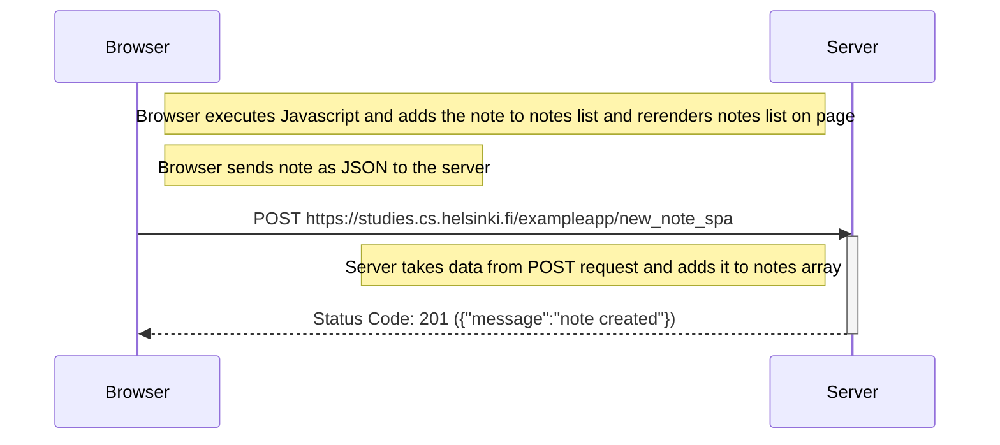

```mermaid

sequenceDiagram
    participant Browser
    participant Server

    Note right of Browser: Browser executes Javascript and adds the note to notes list and rerenders notes list on page
    Note right of Browser: Browser sends note as JSON to the server
    Browser->>Server: POST https://studies.cs.helsinki.fi/exampleapp/new_note_spa
    activate Server
    Note left of Server: Server takes data from POST request and adds it to notes array
    Server-->>Browser: Status Code: 201 ({"message":"note created"})
    deactivate Server

```
